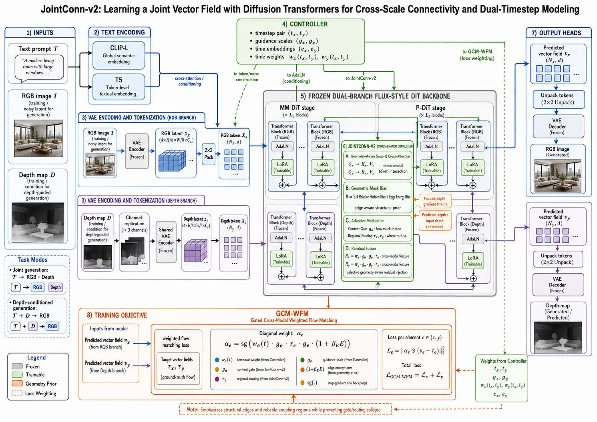
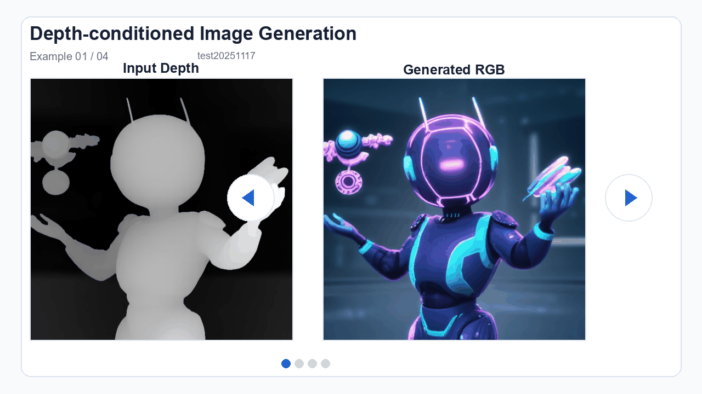
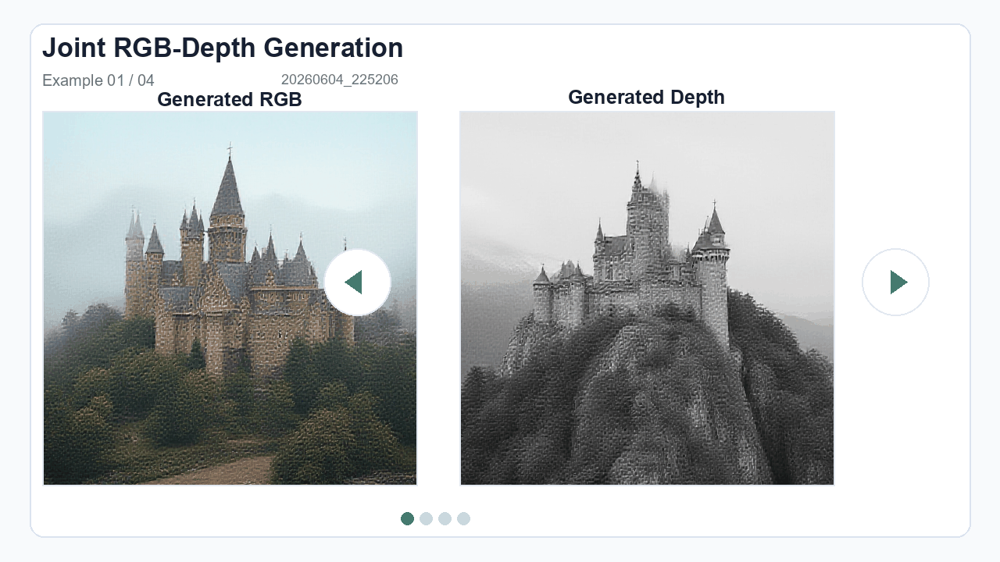

# JointConn-v2

JointConn-v2 is a research codebase for RGB-depth joint generation and depth-conditioned image generation. The implementation is built on a frozen FLUX.1-dev style Diffusion Transformer backbone, with trainable LoRA adapters and JointConn-v2 cross-modal connector modules.

This repository is the modified JointConn-v2 workspace. Original JointDiT baseline runs should be launched from the separately downloaded original JointDiT repository, not from this workspace.



## Qualitative Showcase

The README uses lightweight animated GIFs to mimic a carousel in Markdown. These examples are selected from saved inference outputs under `outputs/depth_to_image` and `outputs/joint_generation`.

### Depth-Conditioned Image Generation

`(T, D) -> I`: the depth branch remains fixed while the RGB branch is generated.



### Joint RGB-Depth Generation

`T -> (I, D)`: RGB and depth are generated together through the dual-branch model.



## 1. Model Overview

JointConn-v2 targets two tasks:

- Joint RGB-depth generation: `T -> (I, D)`.
- Depth-conditioned image generation: `(T, D) -> I`.

The model uses a batch-split RGB/depth formulation:

```text
batch[:B] = RGB branch
batch[B:] = Depth branch
```

The core modules are:

- Frozen FLUX.1-dev DiT backbone.
- Frozen VAE, CLIP-L, and T5-XXL text encoders.
- LoRA adapters for lightweight branch adaptation.
- JointConn-v2 connector blocks inserted into transformer blocks.
- Geometry-aware cross-modal communication using edge energy maps.
- GCM-WFM packed-token loss for RGB/depth branch supervision.

Backbone details used by this code:

```text
Backbone: black-forest-labs/FLUX.1-dev
Local checkpoint: models/flux/flux1-dev.safetensors
Official scale: about 12B parameters
Local transformer parameter count: 11,901,408,320 bf16 parameters
Hidden size: 3072
Attention heads: 24
Double-stream blocks: 19
Single-stream blocks: 38
Packed token channel dim: 64
```

Only adapter parameters are saved by the JointConn-v2 training path:

```text
lora_A / lora_B
jointconn_v2.*
joint1 / joint2 compatibility parameters when enabled
```

## 2. Repository Layout

```text
JointConn-v2/
  jointconn_v2_library/
    jointconn_v2_model.py       # FLUX-style DiT backbone wrapper
    jointconn_v2_utils.py       # model construction, LoRA, checkpoint helpers
    jointconn_v2.py             # JointConn-v2 connector
    geometry.py                 # edge energy maps
    gcm_wfm.py                  # GCM-WFM loss
    inference_pipeline.py       # generation and denoising loops
  dataset/
    jointconn_v2_dataset.py
    preprocess_step1.py         # image/depth/caption preprocessing
    preprocess_step2.py         # VAE/text latent cache
    preprocess_step3.py         # evaluation and empty prompt cache
  scripts/
    smoke_jointconn_v2.py       # lightweight module smoke test
    build_readme_showcase.py    # rebuild README qualitative GIFs
  assets/
    jointconn_v2_framework.png
    readme_showcase/            # animated README qualitative examples
  experiments/
    progress.md                 # experiment log
    validation/fixed_set/       # fixed smoke validation inputs
  models/
    flux/                       # FLUX.1-dev, AE, CLIP-L, T5-XXL
    original_baseline/          # local archived original baseline weights
  checkpoints/
    depth_anything_v2_vitl.pth  # Depth Anything V2 checkpoint
```

## 3. Environment Setup

The code has been tested on Windows PowerShell with one RTX 4090 24GB GPU.

Known working runtime:

```text
Python: 3.10
PyTorch: 2.2.1+cu118
CUDA: 11.8 runtime
Accelerate: 0.33.0
Mixed precision: bf16
```

Create and activate a Python environment:

```powershell
cd D:\code\JointConn-v2
python -m venv .venv
.\.venv\Scripts\Activate.ps1
python -m pip install --upgrade pip
```

Install PyTorch and project dependencies:

```powershell
pip install torch==2.2.1+cu118 torchvision==0.17.1+cu118 --index-url https://download.pytorch.org/whl/cu118
pip install -r requirements.txt
```

If you use the existing local environment from previous experiments:

```powershell
$python = 'C:\Users\zhao\Documents\New project\.venvs\swiftedit\Scripts\python.exe'
```

Check GPU state before long jobs:

```powershell
nvidia-smi --query-gpu=memory.used,memory.total,utilization.gpu --format=csv,noheader
```

## 4. Pretrained Models

Create model directories:

```powershell
mkdir models\flux
mkdir checkpoints
```

Install the Hugging Face CLI and log in. FLUX.1-dev is a gated model, so you must accept the model license on Hugging Face first.

```powershell
pip install huggingface-hub
huggingface-cli login
```

Download FLUX.1-dev transformer and VAE:

```powershell
huggingface-cli download black-forest-labs/FLUX.1-dev `
  flux1-dev.safetensors ae.safetensors `
  --local-dir models/flux `
  --local-dir-use-symlinks False
```

Download FLUX text encoders:

```powershell
huggingface-cli download comfyanonymous/flux_text_encoders `
  clip_l.safetensors t5xxl_fp16.safetensors `
  --local-dir models/flux `
  --local-dir-use-symlinks False
```

Expected files:

```text
models/flux/flux1-dev.safetensors
models/flux/ae.safetensors
models/flux/clip_l.safetensors
models/flux/t5xxl_fp16.safetensors
```

Download Depth Anything V2 Large for pseudo-depth preprocessing:

```powershell
huggingface-cli download depth-anything/Depth-Anything-V2-Large `
  depth_anything_v2_vitl.pth `
  --local-dir checkpoints `
  --local-dir-use-symlinks False
```

The preprocessing script expects:

```text
checkpoints/depth_anything_v2_vitl.pth
```

LLaVA captions are generated through `llava-hf/llava-1.5-7b-hf` and are downloaded automatically by Transformers during `dataset/preprocess_step1.py`.

Reference model pages:

- FLUX.1-dev: https://huggingface.co/black-forest-labs/FLUX.1-dev
- FLUX text encoders: https://huggingface.co/comfyanonymous/flux_text_encoders
- Depth Anything V2: https://github.com/DepthAnything/Depth-Anything-V2
- LLaVA-1.5-7B HF: https://huggingface.co/llava-hf/llava-1.5-7b-hf

## 5. Data Preparation

### 5.1 Expected Raw Input

Put raw `.jpg` or `.png` images directly under a dataset folder:

```text
data/my_dataset/
  image_0001.jpg
  image_0002.png
  ...
```

### 5.2 Step 1: Image Resize, Depth Prediction, Caption Generation

This step moves raw images to `raw_images/`, creates 512x512 center-cropped images, predicts relative depth maps with Depth Anything V2, and generates text prompts with LLaVA.

```powershell
$python = 'C:\Users\zhao\Documents\New project\.venvs\swiftedit\Scripts\python.exe'
& $python dataset/preprocess_step1.py `
  --image_folder data/my_dataset
```

Outputs:

```text
data/my_dataset/raw_images/
data/my_dataset/processed_images/
data/my_dataset/depthmaps/
data/my_dataset/text_prompts/
```

### 5.3 Step 2: Cache VAE and Text Latents

Latent training is the recommended mode for this project because it avoids repeatedly running the VAE and text encoders during training.

```powershell
& $python dataset/preprocess_step2.py `
  --pretrained_model_name_or_path models/flux/flux1-dev.safetensors `
  --clip_l models/flux/clip_l.safetensors `
  --t5xxl models/flux/t5xxl_fp16.safetensors `
  --ae models/flux/ae.safetensors `
  --image_folder data/my_dataset `
  --depth_transform none `
  --mixed_precision bf16 `
  --save_precision bf16 `
  --full_bf16 `
  --sdpa
```

Outputs:

```text
data/my_dataset/image_latents/
data/my_dataset/depth_latents/
data/my_dataset/clip_latents/
data/my_dataset/t5_latents/
data/my_dataset/txt_ids/
data/my_dataset/attn_masks/
data/my_dataset/depth_transform.json
```

### 5.4 Step 3: Cache Evaluation and Empty Prompts

This creates prompt latents used by training-time sampling and optional empty-prompt dropout.

```powershell
& $python dataset/preprocess_step3.py `
  --clip_l models/flux/clip_l.safetensors `
  --t5xxl models/flux/t5xxl_fp16.safetensors `
  --mixed_precision bf16 `
  --save_precision bf16 `
  --full_bf16 `
  --sdpa
```

Outputs:

```text
evaluation_prompts/
empty_prompts/
```

### 5.5 Training Dataset Structure

For latent training, `--image_folder` must contain matching `.pt` filenames in:

```text
image_latents/
depth_latents/
clip_latents/
t5_latents/
```

For non-latent training, `--image_folder` must contain matching sample names in:

```text
processed_images/
depthmaps/
text_prompts/
```

The current smoke experiments used:

```text
data/train2017
```

## 6. Smoke Test

Run the lightweight module test before training:

```powershell
& $python scripts/smoke_jointconn_v2.py
```

Expected output:

```text
JointConn-v2 smoke test passed.
```

Static syntax check:

```powershell
& $python -m py_compile inference.py train.py train_coco_train2017.py `
  dataset/jointconn_v2_dataset.py `
  scripts/smoke_jointconn_v2.py `
  jointconn_v2_library/jointconn_v2_model.py `
  jointconn_v2_library/jointconn_v2_utils.py `
  jointconn_v2_library/inference_pipeline.py `
  jointconn_v2_library/jointconn_v2.py `
  jointconn_v2_library/geometry.py `
  jointconn_v2_library/gcm_wfm.py `
  jointconn_v2_library/relative_position.py
```

## 7. Training

`train_coco_train2017.py` is the recommended training entry for the current COCO-style latent cache. `train.py` is kept as a parallel training entry with similar JointConn-v2 integration.

### 7.1 One-Step Dry Run

Use this first to verify model loading, forward/backward, optimizer step, block swap, and adapter-only saving behavior.

```powershell
$python = 'C:\Users\zhao\Documents\New project\.venvs\swiftedit\Scripts\python.exe'
& $python -m accelerate.commands.launch --config_file default_config.yaml --mixed_precision bf16 train_coco_train2017.py `
  --pretrained_model_name_or_path models/flux/flux1-dev.safetensors `
  --clip_l models/flux/clip_l.safetensors `
  --t5xxl models/flux/t5xxl_fp16.safetensors `
  --ae models/flux/ae.safetensors `
  --image_folder data/train2017 `
  --output_dir experiments/dry_runs `
  --exp_name jointconnv2_one_step `
  --is_latent_training `
  --enable_jointconn_v2 `
  --jointconn_lora_rank 4 `
  --jointconn_gate_hidden_dim 32 `
  --jointconn_routing_hidden_dim 16 `
  --jointconn_output_bottleneck_dim 32 `
  --train_batch_size 1 `
  --max_train_steps 1 `
  --save_every_n_steps 999999 `
  --learning_rate 1e-5 `
  --optimizer_type AdamW `
  --lr_scheduler constant `
  --mixed_precision bf16 `
  --save_precision bf16 `
  --full_bf16 `
  --sdpa `
  --guidance_scale 3.5 `
  --gradient_checkpointing `
  --blocks_to_swap 12 `
  --seed 42 `
  --skip_train_end_full_model_save
```

### 7.2 Short Stability Training

This is the lightweight configuration that has already completed 20-step and 100-step smoke training on RTX 4090 24GB.

```powershell
& $python -m accelerate.commands.launch --config_file default_config.yaml --mixed_precision bf16 train_coco_train2017.py `
  --pretrained_model_name_or_path models/flux/flux1-dev.safetensors `
  --clip_l models/flux/clip_l.safetensors `
  --t5xxl models/flux/t5xxl_fp16.safetensors `
  --ae models/flux/ae.safetensors `
  --image_folder data/train2017 `
  --output_dir experiments/dry_runs `
  --exp_name jointconnv2_100step_stability `
  --is_latent_training `
  --enable_jointconn_v2 `
  --jointconn_lora_rank 4 `
  --jointconn_gate_hidden_dim 32 `
  --jointconn_routing_hidden_dim 16 `
  --jointconn_output_bottleneck_dim 32 `
  --train_batch_size 1 `
  --max_train_steps 100 `
  --save_every_n_steps 50 `
  --learning_rate 1e-5 `
  --optimizer_type AdamW `
  --lr_scheduler constant `
  --mixed_precision bf16 `
  --save_precision bf16 `
  --full_bf16 `
  --sdpa `
  --guidance_scale 3.5 `
  --gradient_checkpointing `
  --blocks_to_swap 12 `
  --seed 42 `
  --skip_train_end_full_model_save
```

Expected adapter outputs:

```text
experiments/dry_runs/jointconnv2_100step_stability/jointconn_v2_addons_step_000050.safetensors
experiments/dry_runs/jointconnv2_100step_stability/jointconn_v2_addons_step_000050.json
experiments/dry_runs/jointconnv2_100step_stability/jointconn_v2_addons_step_000100.safetensors
experiments/dry_runs/jointconnv2_100step_stability/jointconn_v2_addons_step_000100.json
```

### 7.3 Longer Training Template

Use this after the smoke path is healthy:

```powershell
& $python -m accelerate.commands.launch --config_file default_config.yaml --mixed_precision bf16 train_coco_train2017.py `
  --pretrained_model_name_or_path models/flux/flux1-dev.safetensors `
  --clip_l models/flux/clip_l.safetensors `
  --t5xxl models/flux/t5xxl_fp16.safetensors `
  --ae models/flux/ae.safetensors `
  --image_folder data/train2017 `
  --output_dir experiments/training `
  --exp_name jointconnv2_1000step_seed42 `
  --is_latent_training `
  --enable_jointconn_v2 `
  --jointconn_lora_rank 4 `
  --jointconn_gate_hidden_dim 32 `
  --jointconn_routing_hidden_dim 16 `
  --jointconn_output_bottleneck_dim 32 `
  --train_batch_size 1 `
  --max_train_steps 1000 `
  --save_every_n_steps 250 `
  --learning_rate 1e-5 `
  --optimizer_type AdamW `
  --lr_scheduler constant `
  --mixed_precision bf16 `
  --save_precision bf16 `
  --full_bf16 `
  --sdpa `
  --guidance_scale 3.5 `
  --gradient_checkpointing `
  --blocks_to_swap 12 `
  --seed 42 `
  --skip_train_end_full_model_save
```

Expected outputs:

```text
experiments/training/jointconnv2_1000step_seed42/jointconn_v2_addons_step_000250.safetensors
experiments/training/jointconnv2_1000step_seed42/jointconn_v2_addons_step_000500.safetensors
experiments/training/jointconnv2_1000step_seed42/jointconn_v2_addons_step_000750.safetensors
experiments/training/jointconnv2_1000step_seed42/jointconn_v2_addons_step_001000.safetensors
```

## 8. Inference

The inference script loads the FLUX base checkpoint and then loads a JointConn-v2 adapter checkpoint from `--jointconn_v2_addons_path`. If a JSON sidecar exists next to the `.safetensors` file, the script automatically restores the training-time JointConn-v2 configuration.

### 8.1 Depth-Conditioned Image Generation

```powershell
$ckpt = 'experiments/dry_runs/jointconnv2_100step_stability/jointconn_v2_addons_step_000100.safetensors'
& $python inference.py `
  --jointconn_v2_addons_path $ckpt `
  --pretrained_model_name_or_path models/flux/flux1-dev.safetensors `
  --clip_l models/flux/clip_l.safetensors `
  --t5xxl models/flux/t5xxl_fp16.safetensors `
  --ae models/flux/ae.safetensors `
  --gen_type depth_to_image `
  --text_prompt "a red flower with yellow centers is blooming" `
  --input_depth experiments/validation/fixed_set/depth_inputs/d2i_flower_depth.npy `
  --seed 42 `
  --sdpa `
  --guidance_scale 3.5 `
  --blocks_to_swap 12 `
  --mixed_precision bf16 `
  --save_precision bf16 `
  --full_bf16 `
  --sample_steps 4 `
  --inference_output_dir experiments/qualitative/jointconnv2_step100_smoke_20260604/outputs
```

Outputs:

```text
image_<input_name>.png
depth_<input_name>.png
```

### 8.2 Joint RGB-Depth Generation

```powershell
$ckpt = 'experiments/dry_runs/jointconnv2_100step_stability/jointconn_v2_addons_step_000100.safetensors'
& $python inference.py `
  --jointconn_v2_addons_path $ckpt `
  --pretrained_model_name_or_path models/flux/flux1-dev.safetensors `
  --clip_l models/flux/clip_l.safetensors `
  --t5xxl models/flux/t5xxl_fp16.safetensors `
  --ae models/flux/ae.safetensors `
  --gen_type joint_generation `
  --text_prompt castle `
  --output_resolution 512 512 `
  --seed 42 `
  --sdpa `
  --guidance_scale 3.5 `
  --blocks_to_swap 12 `
  --mixed_precision bf16 `
  --save_precision bf16 `
  --full_bf16 `
  --sample_steps 4 `
  --inference_output_dir experiments/qualitative/jointconnv2_step100_smoke_20260604/outputs
```

For paper-quality qualitative results, increase `--sample_steps` after the smoke path is stable:

```text
4 steps: smoke test
20 steps: quick qualitative review
40 steps: paper-style qualitative run
```

### 8.3 Rebuild README Showcase GIFs

After producing new qualitative outputs, rebuild the animated README previews:

```powershell
$python = 'C:\Users\zhao\Documents\New project\.venvs\swiftedit\Scripts\python.exe'
& $python scripts/build_readme_showcase.py `
  --depth-to-image outputs/depth_to_image `
  --joint-generation outputs/joint_generation `
  --max-frames 4
```

By default, the script uses manually selected high-quality examples. To choose different examples, pass comma-separated paired output keys:

```powershell
& $python scripts/build_readme_showcase.py `
  --depth-keys test20251117,test_digital_art_2,000000265518,20251004_212117 `
  --joint-keys 20260604_225206,20251109_012630,20251004_203121,20251024_180841
```

The generated assets are:

```text
assets/readme_showcase/depth_to_image_carousel.gif
assets/readme_showcase/depth_to_image_preview.png
assets/readme_showcase/joint_generation_carousel.gif
assets/readme_showcase/joint_generation_preview.png
```

`depth_estimation` is kept as a legacy-compatible inference mode. It is intentionally rejected when `--enable_jointconn_v2` is active because the current JointConn-v2 paper path focuses on `joint_generation` and `depth_to_image`.

## 9. Important Experiment Configuration

Recommended lightweight RTX 4090 config:

```text
train_batch_size = 1
mixed_precision = bf16
full_bf16 = true
sdpa = true
gradient_checkpointing = true
blocks_to_swap = 12
skip_train_end_full_model_save = true
```

JointConn-v2 smoke training config:

```text
enable_jointconn_v2 = true
jointconn_lora_rank = 4
jointconn_gate_hidden_dim = 32
jointconn_routing_hidden_dim = 16
jointconn_output_bottleneck_dim = 32
jointconn_beta_att = 1.0
jointconn_local_kernel_sigma = 3.0
jointconn_routing_type = three_way
jointconn_beta_loss = 2.0
jointconn_gamma_t = 1.0
jointconn_alpha_min = 0.25
jointconn_alpha_max = 4.0
jointconn_alpha_eps = 1e-6
p_joint_task = 0.5
p_sync = 0.5
lora_branch_mode = depth_only
```

Notes:

- `depth_only` LoRA mode preserves compatibility with the earlier RGB/depth batch-split training behavior.
- `skip_train_end_full_model_save` is strongly recommended for adapter-only experiments; otherwise the script may try to save a full FLUX checkpoint at train end.
- The current PyTorch build used in smoke experiments did not have flash attention enabled, so 24GB VRAM is tight.

## 10. Fixed Validation and Baseline Policy

The initial fixed validation set is:

```text
experiments/validation/fixed_set/manifest.jsonl
experiments/validation/fixed_set/depth_inputs/d2i_flower_depth.npy
experiments/validation/fixed_set/reference_images/d2i_flower_origin.jpg
```

Historical smoke comparison outputs are under:

```text
experiments/baseline/jointdit_original_smoke_20260604/
experiments/qualitative/jointconnv2_step100_smoke_20260604/
```

Original JointDiT baseline runs should use the external original repository:

```text
F:\Phd_Work\Neural Networks and ICML 2026\JointDiT-main
```

Do not reintroduce original JointDiT run scripts into this JointConn-v2 workspace unless explicitly needed. Copy original baseline outputs, logs, and metrics into `experiments/baseline/<EXPERIMENT_ID>/`.

## 11. Troubleshooting

### FLUX.1-dev download is denied

Accept the FLUX.1-dev license on Hugging Face, then run `huggingface-cli login` again.

### CUDA out of memory

Use the lightweight config:

```text
train_batch_size=1
jointconn_lora_rank=4
jointconn_gate_hidden_dim=32
jointconn_routing_hidden_dim=16
jointconn_output_bottleneck_dim=32
blocks_to_swap=12
gradient_checkpointing=true
```

Close other GPU processes and check memory with:

```powershell
nvidia-smi
```

### Training tries to save a full FLUX checkpoint

Add:

```text
--skip_train_end_full_model_save
```

### Inference cannot find JointConn-v2 config

The inference script looks for a JSON sidecar next to the adapter checkpoint:

```text
jointconn_v2_addons_step_000100.safetensors
jointconn_v2_addons_step_000100.json
```

Keep both files together when moving checkpoints.

### Default Python cannot import torch

Use the explicit project Python:

```powershell
$python = 'C:\Users\zhao\Documents\New project\.venvs\swiftedit\Scripts\python.exe'
& $python scripts/smoke_jointconn_v2.py
```

## 12. Useful Project Documents

Read these before continuing experiments:

- `docs/method_intro.md`
- `docs/jointconn_v2_code_implementation_design.md`
- `docs/jointconn_v2_followup_execution_design.md`
- `docs/external_jointdit_baseline_reference.md`
- `experiments/progress.md`

## 13. Lineage and Citation Notes

This project is derived from the original FLUX code lineage and extends it for JointConn-v2 research. Preserve original citations, model licenses, and dataset licenses when preparing a paper release or public repository.

Original references:

- FLUX.1-dev model: https://huggingface.co/black-forest-labs/FLUX.1-dev
- Depth Anything V2 repository: https://github.com/DepthAnything/Depth-Anything-V2
